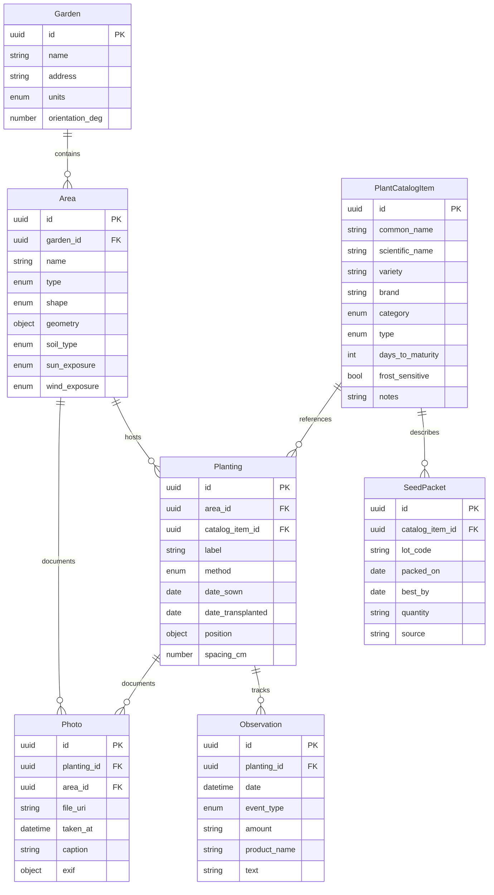

# Garden Journal & Planner - Feature Breakdown

## 1. Core Modules (MVP)

### 1.1 Cataloging Module
**Purpose:** Create and manage a reusable catalog of plants and seed packets

#### Features:
- **Plant Catalog Management**
  - Add/Edit/Delete plant catalog items
  - Required fields: common name, Light requirements (full sun, partial sun, full shade), Soil and Water needs (well-drained soil)
  - Optional fields: scientific name, variety, brand, category, type, days to maturity, frost sensitivity, good drainage, moist conditions,  notes
  - Categories: vegetable, fruit, herb, flower, flower plant, bush, fruit tree
  - Types: seed or seedling
  
- **Seed Packet Tracking**
  - Link seed packets to catalog items
  - Track lot codes, pack dates, expiry dates
  - Monitor quantity remaining
  - Record source (store/online/saved)
  
- **Search & Filter**
  - Search by name
  - Filter by category, brand, type
  - List view with sortable columns

#### Data Entities:
- `PlantCatalogItem`: Core plant information
- `SeedPacket`: Physical seed packet details linked to catalog items

---

### 1.2 Planning Module (Garden Map)
**Purpose:** Visual garden layout with plant placement and tracking

#### Features:
- **Garden Setup**
  - Create garden with name and address
  - Set units (metric/imperial)
  - Define orientation (north arrow)
  - Optional background image upload
  
- **Area Management**
  - Add areas (beds, pots, planters)
  - Define shapes: rectangle, circle, polygon
  - Set area properties:
    - Soil type (clay/loam/sandy/mixed)
    - Sun exposure (full/partial/shade)
    - Wind exposure (low/medium/high)
  
- **Plant Placement**
  - Place plant markers on map
  - Link markers to catalog items
  - Track planting method (direct sow/transplant)
  - Record planting dates
  - Set spacing requirements
  
- **Map Tools**
  - Select/Move/Delete objects
  - Drag to reposition markers
  - Scale and pan controls
  - Orientation indicator

#### Data Entities:
- `Garden`: Top-level container
- `Area`: Physical growing spaces
- `Planting`: Placed plant instances

---

### 1.3 Journaling Module
**Purpose:** Track plant observations, activities, and progress with photos

#### Features:
- **Observation Logging**
  - Create dated entries per plant
  - Event types:
    - General: note, other
    - Care: water, feed, prune
    - Problems: pest, disease, frost
    - Milestones: germination, transplant, flower, harvest
  - Record amounts (e.g., "1L water")
  - Note product names (fertilizers)
  
- **Photo Management**
  - Attach multiple photos per entry
  - Thumbnail generation
  - Full-screen viewer
  - Photo captions
  - EXIF data preservation
  
- **Timeline Views**
  - Per-plant chronological history
  - Filter by event type
  - Reverse chronological feed
  - Quick-add actions

#### Data Entities:
- `Observation`: Dated journal entries
- `Photo`: Image attachments with metadata

---

## 2. Cross-Cutting Features

### 2.1 Search & Discovery
- Global search across all entities
- Multi-criteria filtering
- Season/year filtering
- Action type filtering

### 2.2 Data Management
- **Export Options**
  - JSON (complete data)
  - CSV (tabular data)
  - Photo folder export
  
- **Import Options**
  - JSON restore
  - Data validation
  - Photo link preservation

### 2.3 Settings & Preferences
- Units toggle (metric/imperial)
- Locale configuration
- Backup/restore options
- Privacy settings

### 2.4 Environmental Data
- Garden orientation storage
- Sun exposure tracking
- Wind exposure notes
- Soil type records

---

## 3. Non-Functional Requirements

### 3.1 Performance
- Response time < 150ms for common actions
- Support devices from last 5 years
- Efficient photo storage/retrieval
- Smooth map interactions

### 3.2 Offline Capability
- Full CRUD operations without internet
- Local data persistence (IndexedDB)
- Client-side photo processing
- No cloud dependencies for MVP

### 3.3 Privacy & Security
- All data stored locally
- No third-party analytics
- No external API calls
- User-controlled exports

### 3.4 Accessibility
- Keyboard navigation
- Screen reader support
- Text alternatives for images
- WCAG color contrast compliance

---

## 4. User Interface Screens

### 4.1 Navigation Structure
```
Home (Tab Navigation)
├── Catalog Tab
│   ├── Catalog List
│   ├── Add/Edit Catalog Item
│   └── Seed Packet Management
├── Map Tab
│   ├── Garden Canvas
│   ├── Area Properties Panel
│   └── Plant Marker Details
└── Journal Tab
    ├── Timeline Feed
    ├── Add Observation
    └── Photo Gallery
```

### 4.2 Key Screens
- **Home Dashboard**: Tab navigation between modules
- **Catalog List**: Searchable grid with actions
- **Plant Detail**: Catalog info + placements + observations
- **Garden Map**: Interactive canvas with toolbar
- **Journal Feed**: Chronological entries with filters
- **Photo Viewer**: Grid thumbnails + lightbox
- **Settings**: Preferences and data management

---

## 5. Technical Architecture

### 5.1 Platform
- Progressive Web App (PWA)
- Mobile-responsive design
- Cross-browser compatibility
- Desktop/mobile support

### 5.2 Data Layer
- IndexedDB for structured data
- Dexie.js wrapper for easier API
- File System Access API for photos
- UUID v4 for ID generation

### 5.3 UI Components
- SVG for garden map (better scaling/hit-testing)
- HTML5 Canvas fallback option
- Client-side image compression
- Responsive grid layouts

### 5.4 Storage Strategy
- Local-first architecture
- Browser-managed blobs for photos
- JSON schema validation
- Atomic transactions

---

## 6. Feature Priority Matrix

### MVP (v0.1) - Core Functionality
| Priority | Feature | Module |
|----------|---------|--------|
| P0 | Create/manage catalog items | Cataloging |
| P0 | Draw garden areas | Planning |
| P0 | Place plant markers | Planning |
| P0 | Add observations | Journaling |
| P0 | Attach photos | Journaling |
| P0 | Offline storage | Infrastructure |
| P1 | Search/filter catalog | Cataloging |
| P1 | Drag/drop markers | Planning |
| P1 | Timeline view | Journaling |
| P1 | Export/Import JSON | Data Management |

### v0.2 - Enhanced Usability
| Priority | Feature | Module |
|----------|---------|--------|
| P2 | Calendar view | Journaling |
| P2 | Local notifications | Reminders |
| P2 | Quick templates | Journaling |
| P2 | Bulk operations | All |
| P2 | Advanced filters | All |

### v0.3 - Advanced Features
| Priority | Feature | Module |
|----------|---------|--------|
| P3 | Weather integration | Planning |
| P3 | Sun path overlay | Planning |
| P3 | Season summaries | Analytics |
| P3 | Germination rates | Analytics |
| P3 | CSV import | Data Management |

---

## 7. Data Model Relationships



---

## 8. User Journey Maps

### 8.1 First-Time User
1. Create first garden → Set location/orientation
2. Add first area → Define bed/pot properties  
3. Add plants to catalog → Enter seed packet info
4. Place plants on map → Position markers
5. Log first observation → Add photos

### 8.2 Returning User (Daily)
1. Open journal → Quick-add water/feed
2. Take photo → Attach to observation
3. Review timeline → Check plant progress

### 8.3 Seasonal Planning
1. Review last year's data → Export/analyze
2. Plan new layout → Rearrange markers
3. Update catalog → Add new varieties
4. Set reminders → Schedule activities

---

## 9. Acceptance Criteria Summary

### Cataloging
✓ CRUD operations for catalog items and seed packets
✓ Search/filter functionality
✓ Data persistence across sessions

### Planning
✓ Create garden with multiple areas
✓ Place and reposition plant markers
✓ Link markers to catalog items
✓ Persist layout state

### Journaling
✓ Create dated observations
✓ Attach multiple photos
✓ Timeline view per plant
✓ Filter by event type

### Cross-Cutting
✓ Offline functionality
✓ Export/Import data
✓ Photo management
✓ < 150ms response times

---

## 10. Release Roadmap

### Phase 1: MVP (v0.1)
**Timeline:** 8-10 weeks
- Core modules operational
- Basic offline storage
- Essential CRUD operations
- Simple export/import

### Phase 2: Usability (v0.2)
**Timeline:** 4-6 weeks post-MVP
- Calendar integration
- Reminder system
- Quick action templates
- Enhanced UI/UX

### Phase 3: Intelligence (v0.3)
**Timeline:** 6-8 weeks post-v0.2
- Weather data integration
- Analytics dashboard
- Companion planting hints
- Advanced import options

### Future Considerations
- Multi-garden support
- Collaborative features
- Cloud sync option
- Mobile native apps
- AI-powered insights